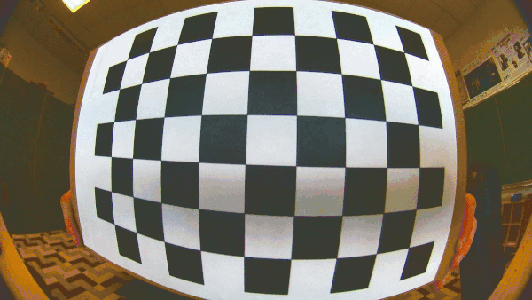
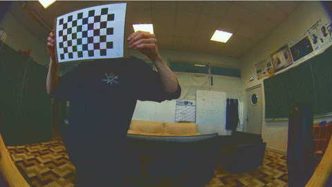
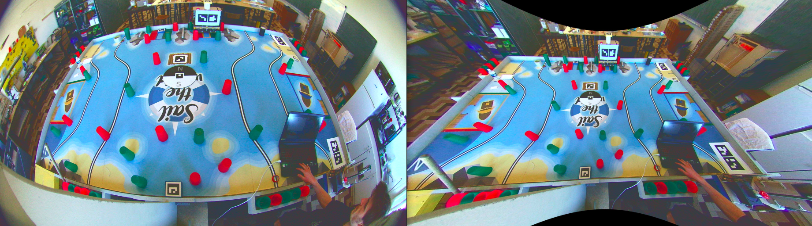
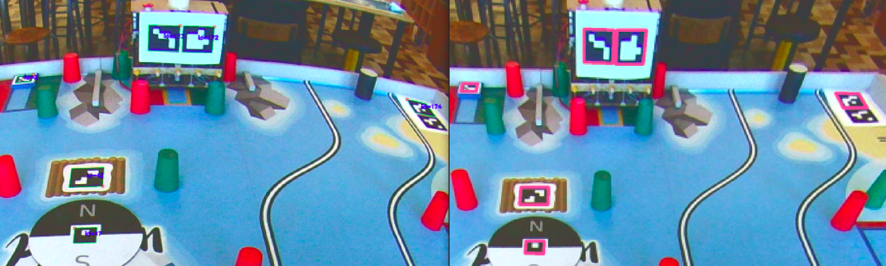

# Camera calibration for cdfr 2021

In order to localize robots and game elements on the game board, our team is using computer vision.

The first stage of computer vision is to understand how camera work and what is its mathematical model in informatics.

## Mathematical representation of a camera

If you want to know what's the black magic behind camera intrinsic matrix and distortions coefficients take a look at the explanation of pinhole and fisheye model below.
- The pinhole model explanation can be found [here](https://calib.io/blogs/knowledge-base/camera-models),
- The fisheye model explanation can be found [here](https://docs.opencv.org/3.4/db/d58/group__calib3d__fisheye.html).

## Model determination

Now we've understood the meaning of the pinhole and fisheye model, we can start coding (in fact just copy/paste and adapt code found on internet as everybody).

What we're about to use is a mix between pinhole and fisheye models.

The [camera we're using](https://www.amazon.com/Camera-IMX317-Sensor-Windows-Android/dp/B08CV37Y2H?th=1) is a 170° field of view, that implies a huge distortion. And just by looking at the lens, it's obvious that we need to find a fisheye model.

**But**, by applying the fisheye model to correct the distortion induced by the lens, we found out that an extra pinhole correction layer might be useful.

## What we've done to find the model

### Data acquisition

First of all, we do need a lot of data to obtain an accurate mathematical model. In this case, expected data are pictures of the [chessboard](https://github.com/robotique-ecam/new_camera_calibration/blob/main/doc/chessboard.pdf) taken in the most locations of your pictures as possible. The python script [take_imgs](https://github.com/robotique-ecam/new_camera_calibration/blob/main/take_imgs.py) is perfect for this kind of data acquisition, it takes a picture of the camera video stream every 2 seconds and stores it in a folder that you can rename set [here](https://github.com/robotique-ecam/new_camera_calibration/blob/1b5c2d52b9632d940edae65e62beef14137b3509/take_imgs.py#L26).

Keep in mind that the more pictures you take, the more accurate your mathematical model will be, **but** the computing time will also be a lot longer. For 400 4k pictures, it took nearly 3 hours to compute the model. The algorithm is iterative, so they're no way to multiprocessing it.

Our first advice will be to take pictures near the camera like so:

 

Our second advice will be not to take pictures really near from the edges of the camera picture if you're doing a fisheye calibration. This will lead you to an absolute mess of an error.

### Data processing

In order to find a model that suits our data, an iterative algorithm is being used to interpolate the best camera intrinsic parameters and distortion coefficients. To simplify to the extreme, the algorithm identifies the edges of the chessboard and tries different coefficients over all the pictures to find the coefficients which give the smallest error in linear interpolation of edges positions over all images. Here's a preview of edges detection in the chessboard:

 

 To calibrate your camera, we've just followed the [opencv tutorial](https://docs.opencv.org/master/dc/dbb/tutorial_py_calibration.html) for the pinhole model. For the fisheye model, we've used [this tutorial](https://medium.com/@kennethjiang/calibrate-fisheye-lens-using-opencv-333b05afa0b0).
 The two scripts are obviously different because computed models are different !
 - Script for [pinhole calibration](https://github.com/robotique-ecam/new_camera_calibration/blob/main/pinhole_model/calibrate.py)
 - Script for [fisheye calibration](https://github.com/robotique-ecam/new_camera_calibration/blob/main/fisheye_model/fisheye_calibration.py)

### Results

All results from different batches of test are stored in [calibration_outputs](https://github.com/robotique-ecam/new_camera_calibration/blob/main/calibration_outputs.txt). The best we've achieved so far isn't perfect, but it's good enough for our usage.

 

Now we just have to project the pixels of interest from distorted image to the undistorted one using the [projection_fisheye_to_pinhole](https://github.com/robotique-ecam/new_camera_calibration/blob/main/projection_fisheye_to_pinhole.py) script which gives the following results:

 
